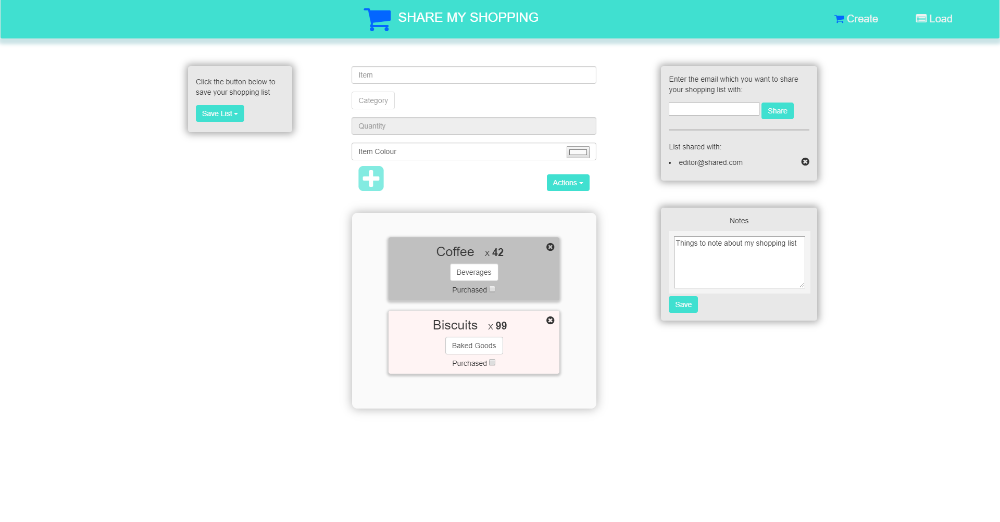

# Share My Shopping

This repository contains the code-base for a shopping list website, **Share My Shopping**, that is hosted as an Azure App service. The website can be accessed [here](http://sharemyshopping.azurewebsites.net/).

To run the project locally, simply run:

`node index`

Note that this requires you to be running a local MySQL database which can be connected to the application by referring to the relevant wiki page [here](https://github.com/JaredP94/Share-My-Shopping/wiki/Configuring-MySQL-for-Local-Dev-vs-Azure-Deployment).

The user story map used in the project can be accessed [here](https://sharemyshopping.storiesonboard.com/m/guidemap). GitHub's Projects was used to manage collaborative development

MySQL in App service is utilized for server persistence.

## Share My Shopping Demonstration

